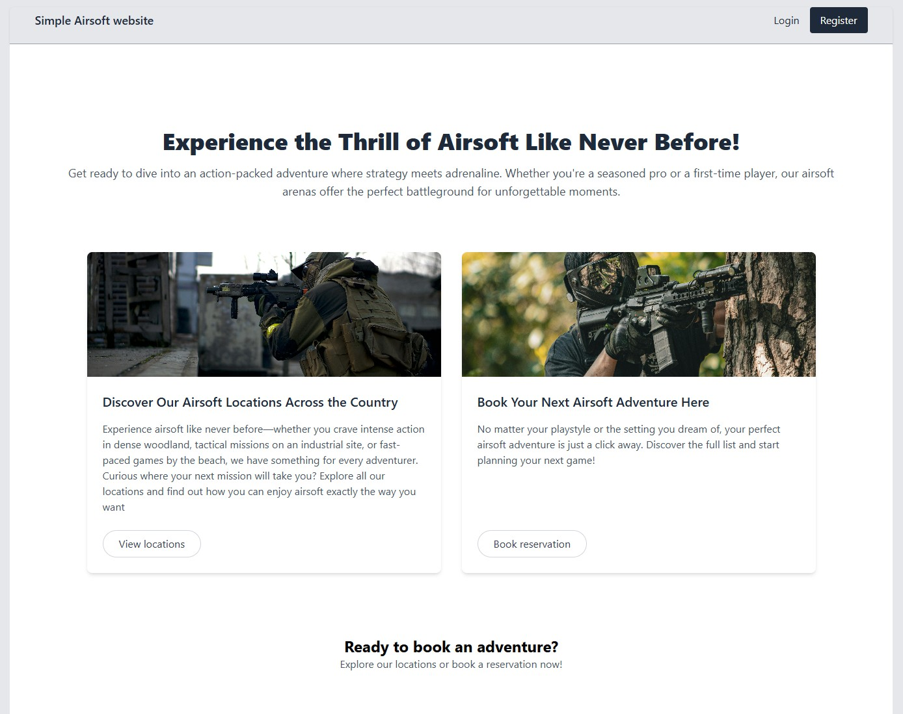

# Simple Laravel Airsoft Website

## Description

An Airsoft example website I built using Laravel (PHP) as a demo project for learning and showcasing Laravel features.

## Endpoints

### REST

| Method | Endpoint                | Description                      |
| ------ | ----------------------- | -------------------------------- |
| `GET`  | `/sites/locations`      | Get all available locations      |
| `GET`  | `/sites/locations/{id}` | Get location details             |

### Rss feed

| Method | Endpoint      | Description                         |
| ------ | ------------- | ----------------------------------- |
| `GET`  | `/sites/feed` | Get all available sites             |

## Code Formatter

* ./vendor/bin/pint (format laravel code)
* npm run format:blade (format blade code)

## Credits

For the images I make use of pexels.com. Credit for the free to use images are not needed but I post it here anyway

#### Homepage images:

* GMB VISUALS https://www.pexels.com/nl-nl/foto/man-vent-kerel-zomer-17028778/
* Kony Xyzx https://www.pexels.com/nl-nl/foto/man-in-camouflage-jas-met-een-geweer-3706640/

#### Site images:
* Shane Kell https://www.pexels.com/nl-nl/foto/bruin-en-grijs-houten-huis-naast-groene-blad-hoge-boom-1365110/
* William Alexander https://www.pexels.com/nl-nl/foto/huis-dichtbij-weg-op-bos-189243/
* Matt Barnard https://www.pexels.com/nl-nl/foto/bos-woud-herfst-seizoen-11705760/

## Notes
* Images have not been optimized, so file sizes may be relatively large.
* Location data is for demonstration purposes only and does not accurately match the provided postal codes.
